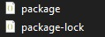
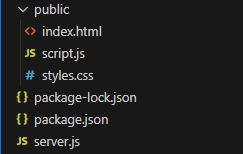
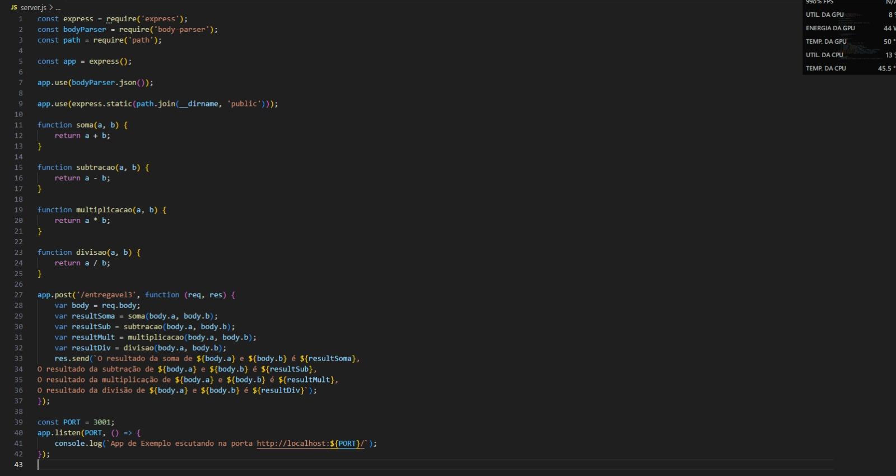
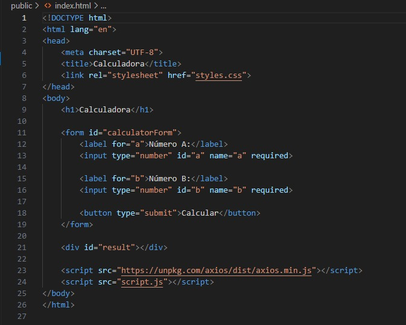
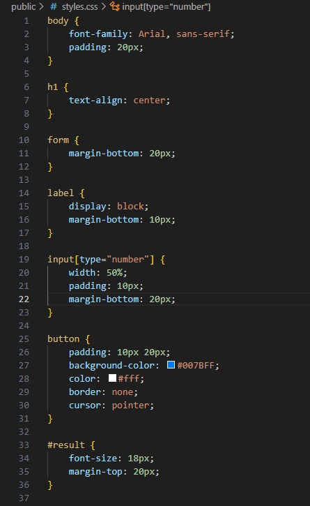
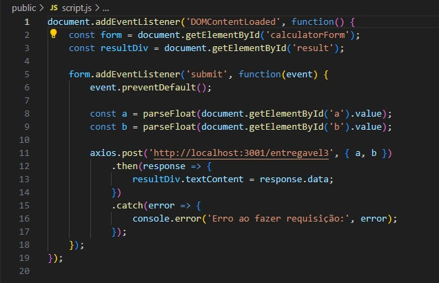
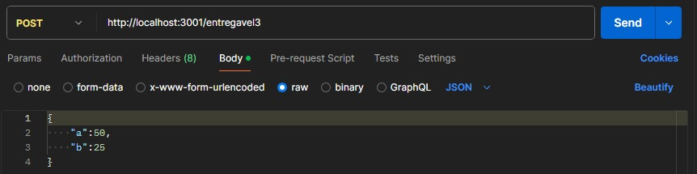

# Calculadora API com Express

Este é um simples guia passo a passo para criar uma API de calculadora usando Node.js e Express.

## Pré-requisitos

- VS Code (Visual Studio Code) instalado 
- Node.js instalado
- npm (Node Package Manager) instalado

Se você ainda não tem o Node.js e o npm instalados, siga as instruções abaixo.

### Instalando o Node.js e npm

1. **Windows**:
   - Acesse [Node.js Downloads](https://nodejs.org/en/download/) e baixe o instalador do Node.js.
   - Execute o instalador e siga as [instruções](https://www.alura.com.br/artigos/como-instalar-node-js-windows-linux-macos) para instalar o Node.js e o [npm](https://balta.io/blog/node-npm-instalacao-configuracao-e-primeiros-passos).

2. **macOS**:
   - Você pode instalar o Node.js e o npm usando o Homebrew:
     ```bash
     brew install node
     ```

3. **Linux** (Ubuntu/Debian):
   - Você pode instalar o Node.js e o npm usando o apt:
     ```bash
     sudo apt update
     sudo apt install nodejs npm
     ```

## Inicializando o Projeto (CMD)

1. **Crie uma nova pasta para o projeto e navegue até ela:**
    ```bash
    mkdir calculadora-express
    cd calculadora-express
    ```

2. **Inicialize um novo projeto Node.js:**
    ```bash
    npm init -y
    ```

    Isso irá criar os seguintes arquivos:
   
   

## Instalando o Express

1. **Instale o Express:**

   Também dentro do terminal, execute o seguinte código:
   
    ```bash
    npm install express
    ```
    Isso irá criar os seguintes arquivos:
   
   

## Estrutura do projeto

Crie uma estrutura de pasta exatamente igual a essa à seguir (os arquivos html, css e o script.js serão criados no futuro):
calculadora-express/




### Descrição dos Arquivos

- **public/**: Pasta contendo os arquivos estáticos para o frontend da aplicação.
  - **index.html**: Arquivo HTML principal.
  - **styles.css**: Arquivo CSS para estilização.
  - **script.js**: Arquivo JavaScript para funcionalidades do frontend.

- **server.js**: Arquivo principal do servidor Express que contém a lógica da API de calculadora.


## Criando a API de Calculadora

Crie um arquivo chamado `server.js` na pasta do seu projeto e adicione o seguinte código para configurar um servidor Express básico:



## Criando o HTML

Crie um arquivo chamado `index.html` dentro do diretório `public` e forneca o seguinte código:



## Criando o CSS

Em seguida, crie um arquivo chamado `styles.css` dentro do diretório `public` e forneca o seguinte código:



## Criando o arquivo de comunicação front/back

Crie outro arquivo, dessa vez um `script.js` também dentro do  diretório `public` e forneca o seguinte código:




## Rodando o Projeto

Para rodar o projeto, execute o seguinte comando no terminal do VS Code:


`node server.js`


Agora você deve acessar a API em em algum navegador utilizando a URL `http://localhost:3001/entregavel3` e receber os resultados das operações de soma, subtração, multiplicação e divisão.

## Testando com Postman

1. Abra o Postman.
2. Crie uma nova solicitação POST para `http://localhost:3001/entregavel3`.

  
   
3. No corpo da solicitação, adicione os números para calcular em formato JSON:

   
```bash
    {
      "a":50,
      "b":25
  }
```

4. Envie a solicitação e verifique a resposta.
